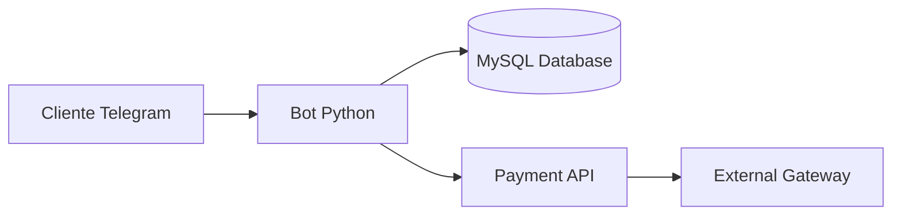
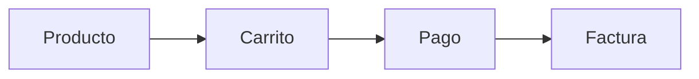

# 📱 Tienda Tecnológica - Bot de Telegram
##  Desarrolladores

- 👨‍💻 Carlos andres ramirez Garcia 7690-21-10603
- 👨‍💻 Elmer Istupe Ruiz 7690-21-10969

-

## 📌 Descripción General

### 🎯 Objetivo
Desarrollar un bot de Telegram inteligente para una tienda tecnológica que permita:
- Explorar productos por categorías
- Gestionar carrito de compras
- Simular pagos y generar facturas
- Ofrecer recomendaciones personalizadas

## ✨ Características Principales

### Catálogo Interactivo
| Función | Descripción |
|---------|-------------|
| 📱 Navegación | Por categorías (celulares, laptops, etc.) |
| 🔍 Búsqueda | Reconocimiento de consultas naturales |
| 📄 Detalles | Precio, stock y especificaciones técnicas |

### Gestión de Compras

## 🚀 Visión General
Bot inteligente para comercio electrónico especializado en tecnología, con:
- Catálogo interactivo
- Sistema de compras completo
- Integración con base de datos MySQL
- Panel de administración (ver roadmap)

## 2. Estructura del Proyecto

- `interpretaciones.py`: Manejador de interacciones del bot (Telegram + MySQL).
- `scripts/init_db.sql`: Script para crear base de datos y tablas.
- `.env.example`: Configuración de entorno.
- `README.md`: Documentación externa para usuarios.
- `bot con interaccion.py`:estructura general del bot 

## 3. Arquitectura Técnica

- Lenguaje: Python 3.11+
- Bot Framework: `python-telegram-bot`
- Base de datos: MySQL 8
- ORM: pymysql (con conexiones manuales)
- Variables de entorno: `python-dotenv`

## 4. Descripción de la Base de Datos

### Tabla: `productos`
Contiene todos los artículos disponibles. Utiliza un campo `JSON` para permitir almacenar especificaciones técnicas flexibles.

### Tabla: `precios_historicos`
Historial de cambios de precio, útil para análisis y visualización.

### Tabla: `predicciones_precios`
Almacena predicciones futuras del precio con una confianza estimada.

### Tabla: `interacciones_chatbot`
Registra cada conversación útil para futuras mejoras del sistema (ej. NLP).

## 5. Seguridad

- Las credenciales se manejan por variables de entorno.
- No se sube ningún archivo `.env` al repositorio.
- El bot no expone ninguna ruta web o API externa.

## 6. Futuras Mejoras

- Integración con un motor de NLP como Rasa o Dialogflow.
- Interfaz web administrativa.
- Exportación de estadísticas.
- Sistema de recomendaciones basado en IA.

